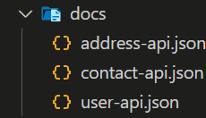

# LARAVEL RESTFUL API

## POINT UTAMA

### 1. Instalasi

-   Minimal PHP versi 8 atau lebih,

-   Composer versi 2 atau lebih,

-   Lalu pada cmd ketikan `composer create-project laravel/laravel=v10.2.5 belajar-laravel-restful-api`.

---

### 2. Pengenalan

-   Laravel adalah salah satu framework PHP yang sangat populer untuk pengembangan web dan juga sangat bagus untuk membangun RESTful API. RESTful API adalah antarmuka pemrograman aplikasi yang memungkinkan sistem berinteraksi satu sama lain melalui HTTP dengan menggunakan operasi standar HTTP seperti GET, POST, PUT, DELETE, dll.

---

### 3. User API Spec

-   Buat folder baru bernama `docs`, buat file user API dalam bentuk JSON.

-   Buat 3 file yaitu, `user-api`, `contact-api` dan `address-api`.---

    

---

### 4. SetUp Database

-   Buat database `beljar_laravel_restful_api`,

-   Ubah konfigurasi database di file `.env`.

---

### 5. User Model

-   Gunakan perintah `php artisan make:model User --migration --seed` untuk membuat Model, Database Migration & Seeder nya.

-   Kode User Migration

    ```PHP
    public function up(): void
    {
        Schema::create('users', function (Blueprint $table) {
            $table->id();
            $table->string("username", 100)->nullable(false)->unique("users_username_unique");
            $table->string("password", 100)->nullable(false);
            $table->string("name", 100)->nullable(false);
                        $table->string("token", 100)->nullable()->unique("users_token_unique");
            $table->timestamps();
        });
    }

    public function down(): void
    {
        Schema::dropIfExists('users');
    }
    ```

-   Kode User Model

    ```PHP
    class User extends Model implements Authenticatable
    {
        protected $table = "users";
        protected $primaryKey = "id";
        protected $keyType = "int";
        public $timestamps = true;
        public $incrementing = true;

        protected $fillable = [
        'username',
        'password',
        'name'
    ];

        public function contacts(): HasMany
        {
            return $this->hasMany(Contact::class, "user_id", "id");
        }
    }
    ```

---

### 6. Contact Model

-   Gunakan perintah `php artisan make:model Contact --migration --seed` untuk membuat Model, Database Migration & Seeder nya.

-   Kode Contact Migration

    ```PHP
    public function up(): void
    {
        Schema::create('contacts', function (Blueprint $table) {
            $table->id();
            $table->string("first_name", 100)->nullable(false);
            $table->string("last_name", 100)->nullable();
            $table->string("email", 200)->nullable();
            $table->string("phone", 20)->nullable();
            $table->unsignedBigInteger("user_id")->nullable(false);
            $table->timestamps();

            $table->foreign("user_id")->on("users")->references("id");
        });
    }

    public function down(): void
    {
        Schema::dropIfExists('contacts');
    }
    ```

-   Kode Contact Model

    ```PHP
    class Contact extends Model
    {
        protected $primaryKey = "id";
        protected $keyType = "int";
        protected $table = "contacts";
        public $incrementing = true;
        public $timestamps = true;

        public function user(): BelongsTo
        {
            return $this->belongsTo(Contact::class, "user_id", "id");
        }

        public function addresses(): HasMany
        {
            return $this->hasMany(Address::class, "contact_id", "id");
        }
    }
    ```

---

### 7. Address Model

-   Gunakan perintah `php artisan make:model Address --migration --seed` untuk membuat Model, Database Migration & Seeder nya.

-   Kode Address Migration

    ```PHP
    public function up(): void
    {
        Schema::create('addresses', function (Blueprint $table) {
            $table->id();
            $table->string("street", 200)->nullable();
            $table->string("city", 100)->nullable();
            $table->string("province", 100)->nullable();
            $table->string("country", 100)->nullable(false);
            $table->string("postal_code", 10)->nullable();
            $table->unsignedBigInteger("contact_id")->nullable(false);
            $table->timestamps();

            $table->foreign("contact_id")->on("contacts")->references("id");
        });
    }

    public function down(): void
    {
        Schema::dropIfExists('addresses');
    }
    ```

-   Kode Model Address

    ```PHP
    class Address extends Model
    {
        protected $table = "addresses";
        protected $primaryKey = "id";
        protected $keyType = "int";
        public $incrementing = true;
        public $timestamps = true;

        public function contact(): BelongsTo
        {
            return $this->belongsTo(Contact::class, "contact_id", "id");
        }
    }
    ```

---

### 8. Register User API

-   Gunakan perintah `php artisan make:request UserRegisterRequest`, nanti akan secara otomatis akan dibuatkan folder Request di `app/Http/Request`.

-   Dan Gunakan perintah `php artisan make:resource UserResource`, nanti akan secara otomatis akan dibuatkan folder Request di `app/Http/Resource`.

-   Kode User Register Request

    ```PHP
    public function authorize(): bool
    {
        return true; // true, agar siapa saja bisa melakukan register
    }

    public function rules(): array
    {
        return [
            'username' => ['required', 'max:100'],
            'password' => ['required', 'max:100'],
            'name' => ['required', 'max:100'],
        ];
    }

    protected function failedValidation(Validator $validator) // validasi jika terjadi error
    {
        throw new HttpResponseException(response([
            "errors" => $validator->getMessageBag()
        ], 400));
    }
    ```

-   Kode User Resource

    ```PHP
    public function toArray(Request $request): array
    {
        return [
            'id' => $this->id,
            'username' => $this->username,
            'name' => $this->name,
            // 'token' => $this->whenNotNull($this->token)
        ];
    }
    ```

-   Kode User Controller

    ```PHP
    public function register(UserRegisterRequest $request): UserResource
    {
        $data = $request->validated();

        // cek apakah sudah register atau belum
        if (User::where('username', $data['username'])->count() == 1) {
            throw new HttpResponseException(response([
                "errors" => [
                    "username" => [
                        "username already registered"
                    ]
                ]
            ], 400));
        }

        $user = new User($data);
        $user->password = Hash::make($data['password']); // hash password menggunakan bcrypt
        $user->save();

        return new UserResource($user);
    }
    ```

-   Kode Route API

    ```PHP
    Route::post('/users', [\App\Http\Controllers\UserController::class, 'register']);
    ```

-   Kode Test Register

    ```PHP
    public function testRegisterSuccess() // test register success
    {
        $this->post('/api/users', [
            'username' => 'akbar',
            'password' => 'rahasia',
            'name' => 'Gusti Alifiraqsha Akbar'
        ])->assertStatus(201)
            ->assertJson([
                "data" => [
                    'username' => 'akbar',
                    'name' => 'Gusti Alifiraqsha Akbar'
                ]
            ]);
    }

    public function testRegisterFailed() // test register gagal
    {
        $this->post('/api/users', [
            'username' => '',
            'password' => '',
            'name' => ''
        ])->assertStatus(400)
            ->assertJson([
                "errors" => [
                    'username' => [
                        "The username field is required."
                    ],
                    'password' => [
                        "The password field is required."
                    ],
                    'name' => [
                        "The name field is required."
                    ]
                ]
            ]);
    }

    public function testRegisterUsernameAlreadyExists() // test register sudah ada
    {
        $this->testRegisterSuccess();
        $this->post('/api/users', [
            'username' => 'akbar',
            'password' => 'rahasia',
            'name' => 'Gusti Alifiraqsha Akbar'
        ])->assertStatus(400)
            ->assertJson([
                "errors" => [
                    'username' => [
                        "username already registered"
                    ]
                ]
            ]);
    }
    ```

---

## PERTANYAAN & CATATAN TAMBAHAN

-   Tidak ada.

---

### KESIMPULAN

-   Laravel adalah framework yang kuat dan menyediakan banyak fitur bawaan untuk membangun RESTful API dengan mudah. Dengan dukungan routing, kontroler, middleware, dan integrasi database yang kuat, Anda dapat membuat API yang andal dan efisien. Laravel juga mendukung pola desain REST secara bawaan. Ini berarti Anda dapat menggunakan HTTP methods seperti GET, POST, PUT, DELETE, dll., dan URL yang konsisten untuk berinteraksi dengan sumber daya Anda. Laravel menyediakan alat untuk mengelola autentikasi, otorisasi, validasi, dan manajemen kesalahan secara efisien. Hal ini memudahkan pengembang dalam memastikan keamanan dan keandalan API mereka.
